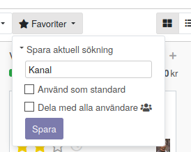

============
Fritextsökning
============

* Standardsökning

Skapa en domän med attribut som skall ingå i "fritextsökningen"

.. note:: Domän byggs upp av en lista med tupler/villkor som kan förekomma i en WHERE-Clause i SQL. Villkoret beskrivs som tre element: attribut, xxx, variabel. Exempelvis ('partner_id','ilike',self). Framför listan beskrivs förhållandet mellan villkoren (OR "|" AND "&")

.. image:: Markering_824.png

Första field name är standardsökningen::

    <field name="name" string="Opportunity" 
       filter_domain="['|','|','|',
            ('partner_id','ilike',self),
            ('partner_name','ilike',self),('email_from','ilike',self),
            ('name', 'ilike', self)]"/>
            
            
Övriga field name är::            
                    <field name="tag_ids" string="Tag" filter_domain="[('tag_ids', 'ilike', self)]"/>
                    <field name="stage_id" domain="[]"/>
                    <field name="user_id"/>
                    <field name="team_id"/>
                    <field name="partner_id" operator="child_of" string="Customer"/>
                    <field name="city"/>
                    <field name="country_id"/>
                    <field name="activity_type_id"/>
                    <field name="activity_summary"/>
                    <field name="probability"/>
                    <field name="lost_reason"/>
                    <field name="date_conversion"/>
                    <separator/>

.. image:: Markering_825.png

.. image:: Markering_826.png

