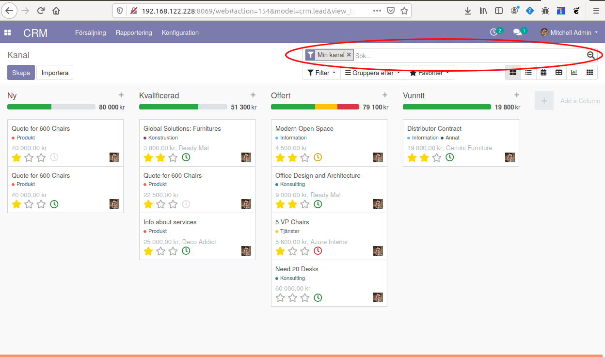
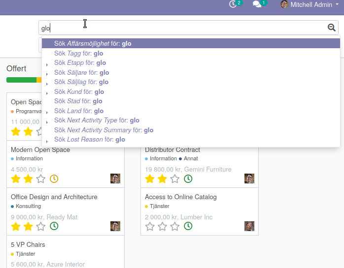

============
Sökrutan
============

* Etiketter för gjorda val (filter/gruppering/favorit)
* Använd förstoringsglaset för att se extra funktioner

kod för sökrutan::

    <search string="Search Opportunities">
                    <field name="name" string="Opportunity" filter_domain="['|','|','|',('partner_id','ilike',self),('partner_name','ilike',self),('email_from','ilike',self),('name', 'ilike', self)]"/>
                    <field name="tag_ids" string="Tag" filter_domain="[('tag_ids', 'ilike', self)]"/>
                    <field name="stage_id" domain="[]"/>
                    <field name="user_id"/>
                    <field name="team_id"/>
                    <field name="partner_id" operator="child_of" string="Customer"/>
                    <field name="city"/>
                    <field name="country_id"/>
                    <field name="activity_type_id"/>
                    <field name="activity_summary"/>
                    <field name="probability"/>
                    <field name="lost_reason"/>
                    <field name="date_conversion"/>
                    <separator/>
                    <filter string="My Pipeline" name="assigned_to_me" domain="[('user_id', '=', uid)]" help="Opportunities that are assigned to me"/>
                    <filter string="Unassigned" name="unassigned" domain="[('user_id','=', False)]" help="No salesperson"/>
                    <filter string="Open Opportunities" name="open_opportunities" domain="[('probability', '&lt;', 100), ('type', '=', 'opportunity')]" help="Open Opportunities"/>
                    <separator/>
                    <filter string="Unread Messages" name="message_needaction" domain="[('message_needaction','=',True)]"/>
                    <separator/>
                    <filter string="Overdue Opportunities" name="overdue_opp" domain="[('date_deadline', '&lt;', context_today().strftime('%Y-%m-%d')), ('date_closed', '=', False)]" help="Opportunities with a date of Expected Closing which is in the past"/>
                    <filter string="Creation Date" name="creation_date" date="create_date"/>
                    <filter string="Expected Closing" name="close_this_month" date="date_deadline"/>
                    <filter string="Closed Date" name="close_date" date="date_closed"/>
                    <separator/>
                    <filter string="Won" name="won" domain="['&amp;', ('active', '=', True), ('stage_id.probability', '=', 100)]"/>
                    <filter string="Lost" name="lost" domain="['&amp;', ('active', '=', False), ('probability', '=', 0)]"/>
                    <separator/>
                    <filter string="Activities Todo" name="activities_my" domain="[('activity_ids.user_id', '=', uid)]"/>
                    <separator/>
                    <filter string="Late Activities" name="activities_overdue" domain="[('activity_ids.date_deadline', '&lt;', context_today().strftime('%Y-%m-%d'))]" help="Show all opportunities for which the next action date is before today"/>
                    <filter string="Today Activities" name="activities_today" domain="[('activity_ids.date_deadline', '=', context_today().strftime('%Y-%m-%d'))]"/>
                    <filter string="Future Activities" name="activities_upcoming_all" domain="[('activity_ids.date_deadline', '&gt;', context_today().strftime('%Y-%m-%d'))                         ]"/>
                    <group expand="0" string="Group By" colspan="16">
                        <filter string="Salesperson" name="salesperson" context="{'group_by':'user_id'}"/>
                        <filter string="Sales Team" name="saleschannel" context="{'group_by':'team_id'}"/>
                        <filter name="stage" string="Stage" context="{'group_by':'stage_id'}"/>
                        <filter name="city" string="City" context="{'group_by': 'city'}"/>
                        <filter string="Country" name="country" context="{'group_by':'country_id'}"/>
                        <filter string="Lost Reason" name="lostreason" context="{'group_by':'lost_reason'}"/>
                        <filter string="Company" name="company" context="{'group_by':'company_id'}" groups="base.group_multi_company"/>
                        <filter string="Campaign" name="compaign" domain="[]" context="{'group_by':'campaign_id'}"/>
                        <filter string="Medium" name="medium" domain="[]" context="{'group_by':'medium_id'}"/>
                        <filter string="Source" name="source" domain="[]" context="{'group_by':'source_id'}"/>
                        <separator orientation="vertical"/>
                        <filter string="Creation Date" context="{'group_by':'create_date:month'}" name="month"/>
                        <filter string="Conversion Date" name="date_conversion" context="{'group_by': 'date_conversion'}" groups="crm.group_use_lead"/>
                        <filter string="Closed Date" name="date_closed" context="{'group_by':'date_closed'}"/>
                        <filter string="Expected Closing Date" name="date_deadline" context="{'group_by':'date_deadline'}"/>
                    </group>
                </search>

Första field name är standardsökningen::

    <field name="name" string="Opportunity" 
       filter_domain="['|','|','|',
            ('partner_id','ilike',self),
            ('partner_name','ilike',self),('email_from','ilike',self),
            ('name', 'ilike', self)]"/>
            
            
Övriga field name är::            
                    <field name="tag_ids" string="Tag" filter_domain="[('tag_ids', 'ilike', self)]"/>
                    <field name="stage_id" domain="[]"/>
                    <field name="user_id"/>
                    <field name="team_id"/>
                    <field name="partner_id" operator="child_of" string="Customer"/>
                    <field name="city"/>
                    <field name="country_id"/>
                    <field name="activity_type_id"/>
                    <field name="activity_summary"/>
                    <field name="probability"/>
                    <field name="lost_reason"/>
                    <field name="date_conversion"/>
                    <separator/>

=========================
Fritextsökning
=========================
.. toctree::
   :maxdepth: 1

   freetext.rst

=========================
Filter
=========================
.. toctree::
   :maxdepth: 1

   filter.rst

   group_by.rst
