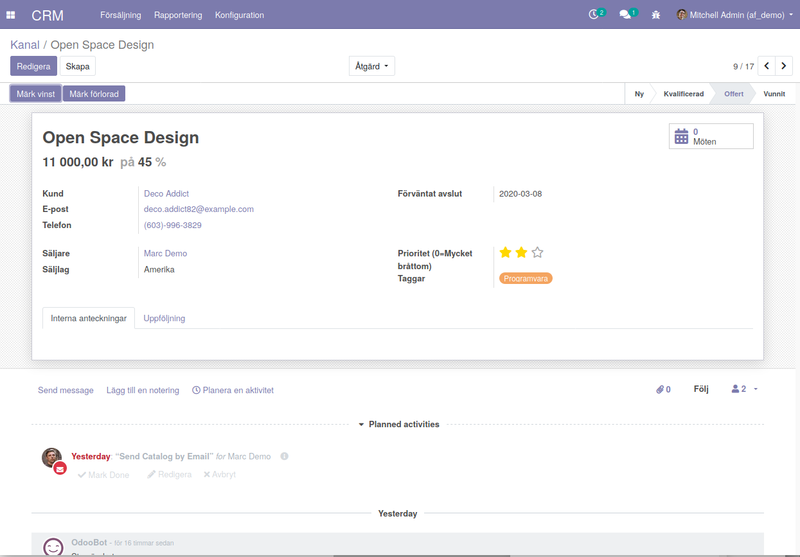
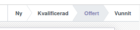

============
Formulär
============

kod för formuläret::

<?xml version="1.0"?>
<form string="Opportunities" class="o_opportunity_form">
                    <header>
                        <button name="action_set_won_rainbowman" string="Mark Won" type="object" class="oe_highlight" attrs="{'invisible': ['|', ('active','=',False), ('probability', '=', 100)]}"/>
                        <button name="136" string="Mark Lost" type="action" class="oe_highlight" context="{'default_lead_id': active_id}" attrs="{'invisible': [('active', '=', False),('probability', '&lt;', 100)]}"/>
                        <button name="toggle_active" string="Restore" type="object" attrs="{'invisible': ['|', ('probability', '&gt;', 0), ('active', '=', True)]}"/>
                        <field name="stage_id" widget="statusbar" options="{'clickable': '1', 'fold_field': 'fold'}" domain="['|', ('team_id', '=', team_id), ('team_id', '=', False)]" attrs="{'invisible': [('active', '=', False)]}"/>
                    </header>
                    <sheet>
                        <field name="active" invisible="1"/>
                        

                            <button class="oe_stat_button" type="object" context="{'partner_id': partner_id}" name="action_schedule_meeting" icon="fa-calendar">
                                

                                    <field name="meeting_count" class="o_stat_value"/>
                                     Meetings
                                     Meeting
                                

                            </button>
                        

                        
Lost

                        
Won

                        

                            <label for="name" class="oe_edit_only"/>
                            <h1><field name="name" placeholder="e.g. Product Pricing"/></h1>
                            <h2 class="o_row row no-gutters d-flex">
                                

                                    <label for="planned_revenue" class="oe_edit_only"/>
                                    

                                        <field name="company_currency" invisible="1"/>
                                        <field name="planned_revenue" class="oe_inline" widget="monetary" options="{'currency_field': 'company_currency'}"/>
                                         at 
                                    

                                

                                

                                    <label for="probability" class="oe_edit_only"/>
                                    

                                        <field name="probability" widget="integer" class="oe_inline"/>
                                         %
                                    

                                

                            </h2>
                        

                        <group>
                            <group>
                                <field name="partner_id" widget="res_partner_many2one" string="Customer" domain="[('customer', '=', True)]" context="{'search_default_customer': 1,                                         'default_name': partner_name, 'default_street': street,                                         'default_street2': street2, 'default_city': city,                                         'default_state_id': state_id, 'default_zip': zip,                                         'default_country_id': country_id, 'default_function': function,                                         'default_phone': phone, 'default_mobile': mobile,                                         'default_email': email_from,                                         'default_user_id': user_id, 'default_team_id': team_id, 'default_website': website,                                         'show_vat': True,                                     }"/>
                                <field name="is_blacklisted" invisible="1"/>
                                <field name="partner_is_blacklisted" invisible="1"/>
                                <label for="email_from" class="oe_inline"/>
                                

                                    <i class="fa fa-ban" style="color: red;" role="img" title="This email is blacklisted for mass mailing" aria-label="Blacklisted" attrs="{'invisible': ['|', ('is_blacklisted', '=', False), ('partner_address_email', '!=', False)]}" groups="base.group_user"/>
                                    <field name="email_from" attrs="{'invisible': [('partner_address_email', '!=', False)]}" string="Email" widget="email"/>
                                    <i class="fa fa-ban" style="color: red;" role="img" title="This email is blacklisted for mass mailing" aria-label="Blacklisted" attrs="{'invisible': ['|', ('partner_is_blacklisted', '=', False), ('partner_address_email', '=', False)]}" groups="base.group_user"/>
                                    <field name="partner_address_email" attrs="{'invisible': [('partner_address_email', '==', False)]}" widget="email" string="Email"/>
                                

                                <field name="partner_address_phone" attrs="{'invisible': [('partner_address_phone', '==', False)]}" readonly="1" widget="phone" string="Phone"/>
                                <field name="phone" attrs="{'invisible': [('partner_address_phone', '!=', False)]}" widget="phone"/>
                            </group>

                            <group>
                                <field name="date_deadline"/>
                            </group>

                            <group>
                                <field name="user_id" context="{'default_groups_ref': ['base.group_user', 'base.group_partner_manager', 'sales_team.group_sale_salesman_all_leads'], 'team_id': team_id}" domain="[('share', '=', False)]"/>
                                <field name="team_id" widget="selection"/>
                            </group>
                            <group>
                                <field name="priority" widget="priority"/>
                                <field name="tag_ids" widget="many2many_tags" options="{'color_field': 'color', 'no_create_edit': True}"/>
                                <field name="lost_reason" attrs="{'invisible': [('active', '=', True)]}"/>
                                <field name="date_conversion" invisible="1"/>
                            </group>
                        </group>

                        <notebook colspan="4">
                        <page string="Internal Notes">
                            <field name="description"/>
                        </page>
                        <page name="lead" string="Followup">
                            <group>
                                <group string="Initial Contact Information">
                                    <field name="partner_name"/>
                                    <label for="street" string="Address"/>
                                    

                                        <field name="street" placeholder="Street..." class="o_address_street"/>
                                        <field name="street2" placeholder="Street 2..." class="o_address_street"/>
                                        <field name="city" placeholder="City" class="o_address_city"/>
                                        <field name="state_id" class="o_address_state" placeholder="State" options="{&quot; 
                                                 no_open&quot;: True}"/>
                                        <field name="zip" placeholder="ZIP" class="o_address_zip"/>
                                        <field name="country_id" placeholder="Country" class="o_address_country" options=       
                                                                   {&quot;no_open&quot;: True, &quot;no_create&quot;: True}"/>
                                    

                                    <field name="website" widget="url" placeholder="e.g. https://www.odoo.com"/>
                                </group>

                                <group class="mt48">
                                    <label for="contact_name"/>
                                    

                                        <field name="contact_name"/>
                                        <field name="title" placeholder="Title" domain="[]" options="{&quot;no_open&quot;: True}"/>
                                    

                                    <field name="function"/>
                                    <field name="partner_address_mobile" attrs="{'invisible': [('partner_address_mobile',   
                                                '=', False)]}" readonly="1" widget="phone" string="Mobile"/>
                                    <field name="mobile" attrs="{'invisible': [('partner_address_mobile', '!=', False)]}" 
                                      widget="phone"/>
                                </group>
                                <group string="Marketing">
                                    <field name="campaign_id"/>
                                    <field name="medium_id"/>
                                    <field name="source_id"/>
                                </group>
                                <group string="Misc" name="Misc">
                                    <field name="day_open" groups="base.group_no_one"/>
                                    <field name="day_close" groups="base.group_no_one"/>
                                    <field name="referred"/>
                                    <field name="type" invisible="1"/>
                                </group>
                            </group>
                        </page>
                        </notebook>
                    </sheet>
                    

                        <field name="message_follower_ids" widget="mail_followers"/>
                        <field name="activity_ids" widget="mail_activity"/>
                        <field name="message_ids" widget="mail_thread" options="{'post_refresh': 'recipients'}"/>
                    

                </form>
            
============
Progress bar
============

    <field name="stage_id" widget="statusbar" 
         options="{'clickable': '1', 'fold_field': 'fold'}" 
         domain="['|', ('team_id', '=', team_id), ('team_id', '=', False)]" attrs="{'invisible': [('active', '=', False)]}"  
   />
   
   
**Knappar**

 .. image:: Markering_837.png
 
 
 Kod för funktionsknapp:
 
      <button name="action_set_won_rainbowman" string="Mark Won" type="object" 
           class="oe_highlight" 
           attrs="{'invisible': ['|', ('active','=',False), ('probability', '=', 100)]}"/>

