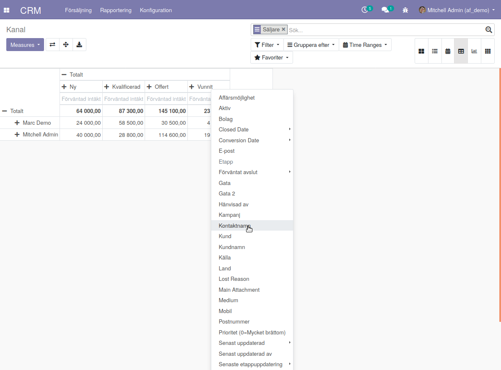

============
Pivot
============

* Pivottabell (BI kub)
* Underlag vyer på anslagstavla

kod för pivottabellen::

   <record id="crm_lead_action_activities" model="ir.actions.act_window">
            <field name="name">Next Activities</field>
            <field name="type">ir.actions.act_window</field>
            <field name="res_model">crm.lead</field>
            <field name="view_mode">tree,form,kanban,calendar,pivot,graph</field>
            <field name="search_view_id" ref="crm.view_crm_case_opportunities_filter"/>
            <field name="view_ids"
                   eval="[(5, 0, 0), (0, 0, {'view_mode': 'tree', 'view_id': ref('crm_lead_view_tree_activity')}),
                          (0, 0, {'view_mode': 'form', 'view_id': ref('crm_case_form_view_oppor')}),
                          (0, 0, {'view_mode': 'kanban'}), (0, 0, {'view_mode': 'calendar'}), (0, 0, {'view_mode': 'pivot'}), (0, 0, {'view_mode': 'graph'})]"/>
            <field name="domain">[('type','=','opportunity'), ('activity_date_deadline', '!=', False)]</field>
            <field name="context">{
                    'default_type': 'opportunity',
                    'default_user_id': uid,
                    'search_default_activities_my': 1,
                }
            </field>
            <field name="help" type="html">
                

                    No next activity
                

                   Here is the list of your next activities. Those are linked to your opportunities.
                   To set a next activity, go on an opportunity and add one. It will then appear in this list.
                

            </field>
        </record>

    
