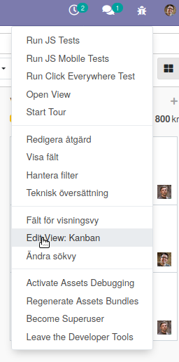

============
Trädvy (lista)
============

* Etiketter för gjorda val (filter/gruppering/favorit)
* Använd förstoringsglaset för att se extra funktioner

.. image:: Markering_701.png

kod för trädvyn::

    

Första field name är standardsökningen::

    <field name="name" string="Opportunity" 
       filter_domain="['|','|','|',
            ('partner_id','ilike',self),
            ('partner_name','ilike',self),('email_from','ilike',self),
            ('name', 'ilike', self)]"/>
            
            
Övriga field name är::

                    <field name="tag_ids" string="Tag" filter_domain="[('tag_ids', 'ilike', self)]"/>
                    <field name="stage_id" domain="[]"/>
                    <field name="user_id"/>
                    <field name="team_id"/>
                    <field name="partner_id" operator="child_of" string="Customer"/>
                    <field name="city"/>
                    <field name="country_id"/>
                    <field name="activity_type_id"/>
                    <field name="activity_summary"/>
                    <field name="probability"/>
                    <field name="lost_reason"/>
                    <field name="date_conversion"/>
                    <separator/>

=========================
Söktyper
=========================
.. toctree::
   :maxdepth: 1

   freetext.rst

.. toctree::
   :maxdepth: 1

   filter.rst

.. toctree::
   :maxdepth: 1
   
   group_by.rst
