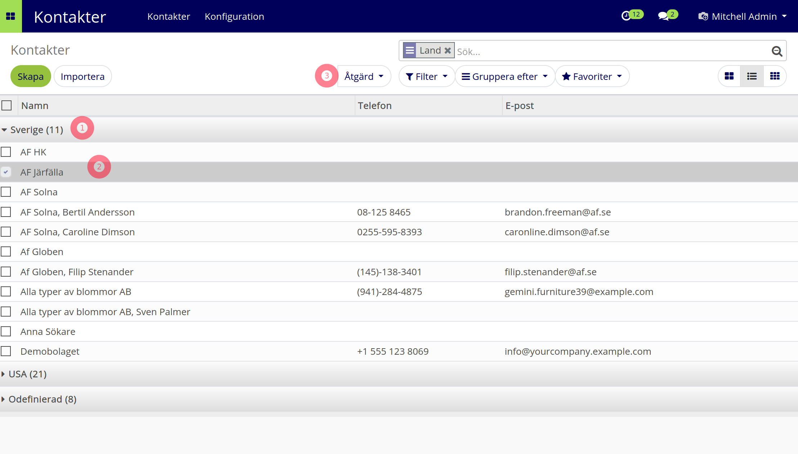

============
Trädvy (lista)
============

* Etiketter för gjorda val (filter/gruppering/favorit)
* Använd förstoringsglaset för att se extra funktioner

1) Drill down, gruppering i flera led
2) Kryssa objekt
3) Metoder som gör något med kryssade objekt

kod för trädvyn::

   <tree string="Contacts">
                    <field name="display_name" string="Name"/>
                    <field name="function" invisible="1"/>
                    <field name="phone"/>
                    <field name="email"/>
                    <field name="user_id" invisible="1"/>
                    <field name="is_company" invisible="1"/>
                    <field name="country_id" invisible="1"/>
                    <field name="parent_id" invisible="1"/>
                    <field name="active" invisible="1"/>
                </tree>
                
                
   

=========================
Söktyper
=========================
.. toctree::
   :maxdepth: 1

   freetext.rst

.. toctree::
   :maxdepth: 1

   filter.rst

.. toctree::
   :maxdepth: 1
   
   group_by.rst
