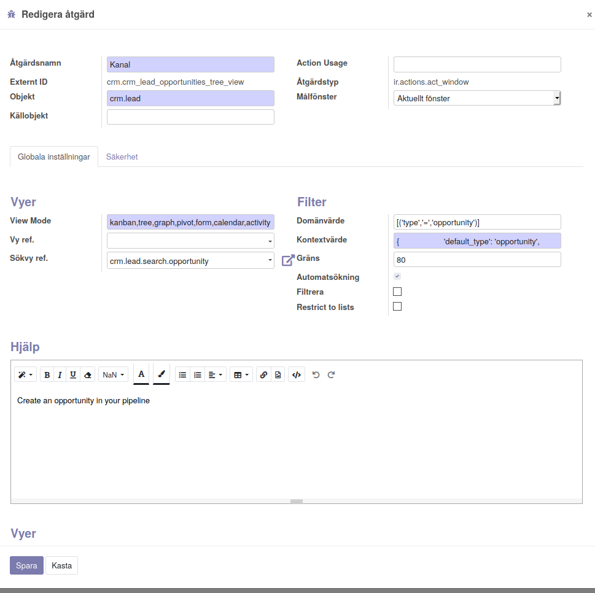

=============================
Vyer startas med en action
=============================

__1) Extern ID__

.. sidebar:: Action
    :subtitle: Viktiga egenskaper
    1) External ID (modul.id-sträng)
    2) Målfönster (aktuellt / 
    3) Vymoder (kanban,tree xxx)
    4) External ID sökvy
    5) Domän, urval av objekt
    6) Kontext sessionsdata, default_type Type i sökrutan 
    

kod för action::

           <record model="ir.actions.act_window" id="crm_lead_opportunities_tree_view">
            <field name="name">Pipeline</field>
            <field name="res_model">crm.lead</field>
            <field name="view_mode">kanban,tree,graph,pivot,form,calendar,activity</field>
            <field name="domain">[('type','=','opportunity')]</field>
            <field name="context">{
                    'default_type': 'opportunity',
                    'search_default_assigned_to_me': 1
            }</field>
            <field name="search_view_id" ref="crm.view_crm_case_opportunities_filter"/>
        </record>
        
Knyt flera vyer till denna action::
      
           <record id="crm_lead_opportunities_tree_view_view_kanban" model="ir.actions.act_window.view">
            <field name="sequence" eval="0"/>
            <field name="view_mode">kanban</field>
            <field name="view_id" ref="crm_case_kanban_view_leads"/>
            <field name="act_window_id" ref="crm_lead_opportunities_tree_view"/>
        </record>
  
