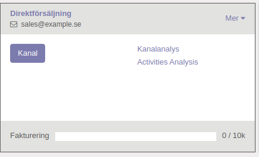
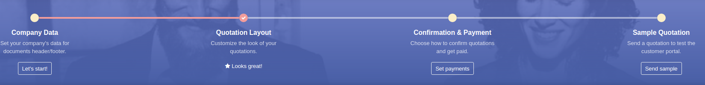

=======
Kanban Widgets
=======

The current KanbanRecord(), can be used to fetch some meta-information. These methods are also available directly in the template context and don’t need to be accessed via widget

.. image:: markering_866.png

.. image:: markering_867.png

